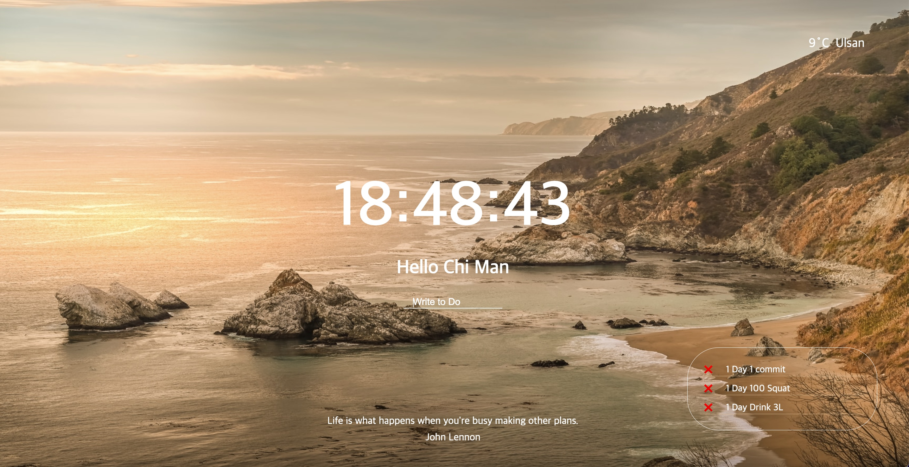

# momentom-2021

- # 사용기술
- - [x] login-form 구현

        사용: 
        - localStorage (get,set)을 통해 값을 저장
        - addEventLister(submit)을 통해 값을 입력시 반응
     
  ---
- - [x]  시계 구현.

        사용: 
        - Date객체 를 통한 getHours, getMinutes,getSeconds로 시간구현 
        - setInterval로 생동감 있는 시계 구현
---
  
- - [x]  랜덤 Quote 구현

        사용: 
        - Math.floor, Math.random을 통해 무작위 선택
---
- - [x]  랜덤 background Img 구현

        사용: 
        - createElement로 html 테그를 JS에서 추가.
        - appendChild를 통해 JS에서 html테그 안에 테그를 생성
---
- - [x]  ToDoList 구현

        사용: 
        - Date.now()를 통한 id값 설정 
        - array.filter를 통해 toDo 리스트 삭제
        - array.forEach를 통해 toDo 리스트 생성
        - JSON.stringify,JSON.parse를 통해 localstorage로 저장 및 사용 
---
- - [x]  Geolocation API를 활용한 날씨,지역 구현

        사용: 
        - navigator.geolocation.getCurrentPosition로 위치정보 얻음 
        - fetch(url), .then(response), .then(data)로 데이터를 얻음
  
---