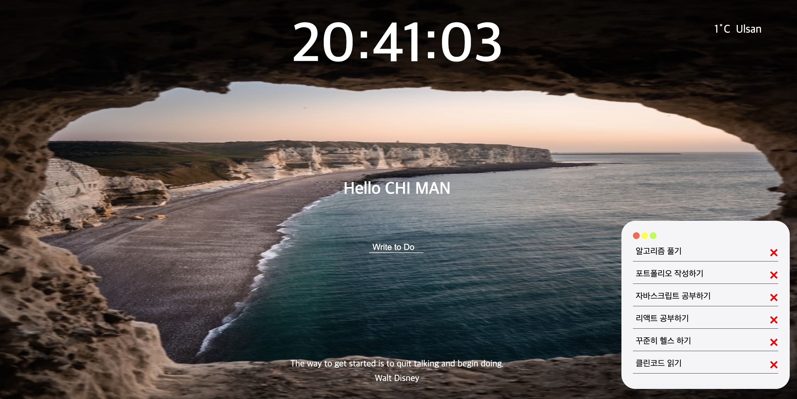
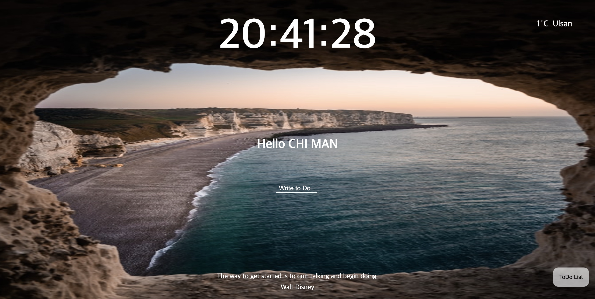
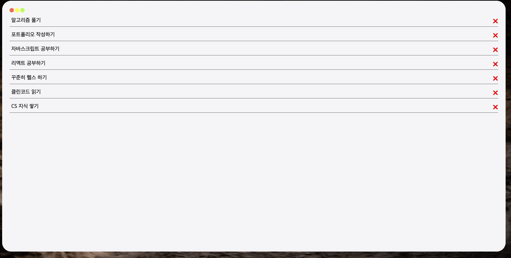

# momentom-2021

| 설명                                   | 사진                  |
| -------------------------------------- | --------------------- |
|           | 로그인 후 이미지      |
|   | 메모장 Close한 이미지 |
|  | 메모장 확대한 이미지  |

# Contents

- [momentom-2021](#momentom-2021)
- [Contents](#contents)
  - [Login-Form구현](#login-form구현)
  - [Clock-구현](#clock-구현)
  - [RandomQuote-구현](#randomquote-구현)
  - [Random-Background-Img-구현](#random-background-img-구현)
  - [ToDoList 구현](#todolist-구현)
  - [Geolocation API 사용](#geolocation-api-사용)

## Login-Form구현

        사용:
        - localStorage (get,set)을 통해 값을 저장
        - addEventLister(submit)을 통해 값을 입력시 반응

## Clock-구현

        사용:
        - Date객체 를 통한 getHours, getMinutes,getSeconds로 시간구현
        - setInterval로 생동감 있는 시계 구현

## RandomQuote-구현

        사용:
        - Math.floor, Math.random을 통해 무작위 선택

## Random-Background-Img-구현

        사용:
        - createElement로 html 테그를 JS에서 추가.
        - appendChild를 통해 JS에서 html테그 안에 테그를 생성

## ToDoList 구현

        사용:
        - Date.now()를 통한 id값 설정
        - array.filter를 통해 toDo 리스트 삭제
        - array.forEach를 통해 toDo 리스트 생성
        - JSON.stringify,JSON.parse를 통해 localstorage로 저장 및 사용
        - Click Event를 통해 ToDoList 창닫기, 확대하기, 축소하기 기능 추가

## Geolocation API 사용

        사용:
        - navigator.geolocation.getCurrentPosition로 위치정보 얻음
        - fetch(url), .then(response), .then(data)로 데이터를 얻음
